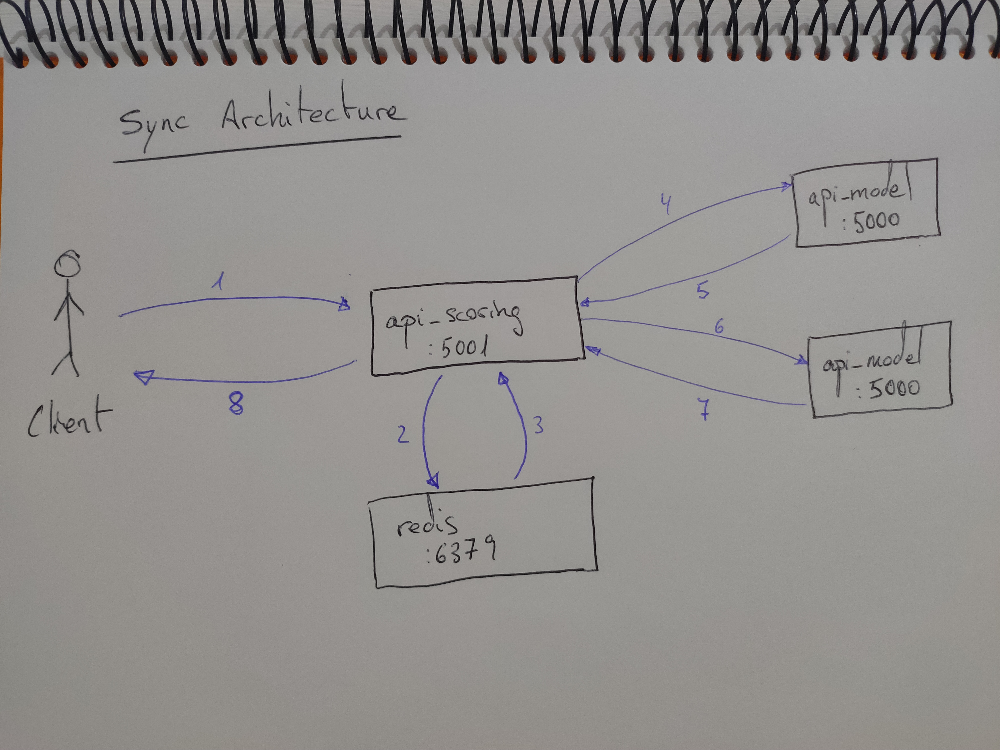

# Challenge

Compare the performance on asynchronous and synchronous architectures for Machine Learning deployment real-time models and understanding where the performance delta comes from.

# Architectures

We will simulate we have a Scoring Handler API in front of models APIs. This Scoring Handler need to get features pre-calculated from a Redis Database, then the model predictions can be executed.

Note than, both the data obtained from Redis and the predictions of the models are faked, in fact, the prediction will be a sleep of between 40 and 50 ms.

Please, take a look to the architecture images. We use 4 different Docker images (scoring handler, feature store, and 2 APIs models). Also, you can follow the communication flow through the numbers.

### Synchronous architecture



**Note:** The synchronous architecture use Flask as API web framework for both `api_scoring` and `api_model`.

### Asynchronous architecture


**Note:** The asynchronous architecture use FastAPI as API web framework for both `api_scoring` and `api_model`.

# Deployment

### To keep in mind

In the experiment all the services are executed in local in a single PC. If you want to reproduce the results in a real situation, please, consider to deploy all the services in a distributed environment, you should not share computation or memory between them. We are doing it because `sleep` does not consume a lot of CPU or memory.

### Prerequisites

* Linux: I have used Ubuntu as OS
* Python v3.8
* Docker: Please, [install Docker](https://docs.docker.com/get-docker/) to follow properly the performance comparison.

### Manage the Docker images

#### Build

Build all the Docker images:

<pre>
$ make docker-build
</pre>

Note: When we build the container, some unit tests are executed.

#### Run

Open 5 Linux terminals and then run one Docker image for each one:

<pre>
$ make docker-run-model-async
$ make docker-run-model-sync
$ make docker-run-scoring-async
$ make docker-run-scoring-sync
$ make docker-run-redis
</pre>

#### Stop

Stop and remove all the Docker containers:

<pre>
$ make docker-stop
</pre>

### Using as client

#### Web browser

You can use your browser to see if the images are up:

* Async API Scoring: http://localhost:8001
* Async API Model: http://localhost:8000
* Sync API Scoring: http://localhost:5001
* Sync API Model: http://localhost:5000

Note that FastAPI provide an `/docs` url (`http://localhost:8001/docs` and `http://localhost:8000/docs`) where you can find an automated API documentation using open standards as OpenAPI (Swagger). You can use not only to get the doc, but also to do API calls as client.

#### Curl

* Async API Scoring:
```
curl "http://localhost:8001/api/v1/healthcheck"
```
* Async API Model:
```
curl "http://localhost:8000/api/v1/healthcheck"
```
* Sync API Scoring:
```
curl "http://localhost:5001/api/v1/healthcheck"
```
* Sync API Model:
```
curl "http://localhost:5000/api/v1/healthcheck"
```

Of course, we can order some predictions using CURL:

* Async API Scoring:
```
curl -X POST "http://localhost:8001/api/v1/ml/async/predict" -H  "accept: application/json" -H  "Content-Type: application/json" -d "[5.1,3.5,1.4,0.2]"
```
* Async API Model:
```
curl -X POST "http://localhost:8000/api/v1/ml/async/predict" -H  "accept: application/json" -H  "Content-Type: application/json" -d "[5.1,3.5,1.4,0.2]"
```
* Sync API Scoring:
```
curl -X POST "http://localhost:5001/api/v1/ml/sync/predict" -H  "accept: application/json" -H  "Content-Type: application/json" -d "[5.1,3.5,1.4,0.2]"
```
* Sync API Model:
```
curl -X POST "http://localhost:5000/api/v1/ml/sync/predict" -H  "accept: application/json" -H  "Content-Type: application/json" -d "[5.1,3.5,1.4,0.2]"
```

#### Notes About Docker images

The FastAPI and Flask Docker images has been created by the same author:

* [FastAPI Docker Image](https://github.com/tiangolo/uvicorn-gunicorn-fastapi-docker)
* [Flask Docker Image](https://github.com/tiangolo/meinheld-gunicorn-flask-docker)

Also, the images have an "auto-tuning" mechanism included to give the best performance possible (or close to that).

So, the **configurations are pretty similar** and the **performance is the maximum** in both cases.

# Benchmarks

### Hardware specifications

You can check a [complete hardware report](doc/pc_specs.html) generated with `lshw` for the pc where all the profiles and benchmarks are running.

To generate one for your pc:

<pre>
sudo lshw -html > pc_specs.html
</pre>

### Experiment 1: Profiling

We profile the Python code (server/client) during a simple REST API call in two different architectures (sync/async).

We use `pyinstrument` and `yappi` profilers to get details about the performance bottlenecks.

[Check the experiment](benchmark/experiment1-profiling)

### Experiment 2

We use the Python utility `timeit` to do some simple performance tests.

We compare graphically the rate of response time on async/sync architectures and we find the percentage of improvement of async version over sync version.

[Check the experiment](benchmark/experiment2-benchmarking-timeit)

### Experiment 3

We run different load tests to find the breaking points of both architectures (sync/async).

* **Example 1: Response time:** We test the performance application for normal requests (low traffic), getting the rate of requests per second.
* **Example 2: Load test:** We test how the application behaves in high traffic times and we find the architectures breaking points.
* **Example 3: Maximum performance:** We test the behavior of both architectures in the max point selected in Example 2 during a long period of time.
* **Example 4: Stress test:** We test how the application operates in a "stress situation" during a long period of time.

To do all the examples, we use [Locust](https://locust.io). This is a Python Open Source load testing tool. Using Locust, we can define the load test in Python versionable code. Also, Locust has utilities to explore the results (Web-based UI, HTML reports, and CSV raw files).

[Check the experiment](benchmark/experiment3-benchmarking-locust)

# Future

### DOING:

* [Communicaton] Prepare a presentation.
* [Communicaton] Prepare Medium publication.

### TODO:

* [Settings] Settings management using Python type annotations (Pydantic)
* [Test] Include Pytest
* [Test/CI] Tox
* [Test/CI] Github Actions, CircleCI
* [Documentation] Sphinx
* [Docker] Orchestrate Docker images using Docker-compose, Podman-compose or Kubernetes.

### Future

* [Tools] Include [BentoML](https://github.com/bentoml/BentoML) deployment model. They speak about largely increases the overall throughput of the API server (over FastAPI and Flask) using `Batch processing`, not on-demand: https://docs.bentoml.org/en/latest/quickstart.html#hello-world
* [Deployment] Because the Scoring Handler API or Models API could be slow processes (a lot of computation when predict, need to talk to databases, call to third party APIs, microservices communication, etc.), we should consider implementing a solution using a FIFO queue, where the backend receives a request from the user, push the job into a queue and replies to the user quickly something as "I’ll do that calculation. It has ID XXX. Please wait". Now, the user can query the backend what is the progress of his task and get the results when it is finished. More info about this topic [here](https://towardsdatascience.com/there-are-two-very-different-ways-to-deploy-ml-models-heres-both-ce2e97c7b9b1).

# Notes

I do not have much experience in profiling and benchmarking, so please do not hesitate to advise me on related good practices.

### About the tools

* [**FastAPI**](https://fastapi.tiangolo.com/) is a modern web framework, ideal for building high-performance asyncio services. It has very high performance, on par with NodeJS and Go. Also, it is based on standard Python type hints and the open standards for APIs: OpenAPI (previously known as Swagger) and JSON Schema.

* [**Flask**](https://flask.palletsprojects.com/) is a lightweight WSGI web application framework.

* [**Redis**](https://redis.io/) is an in-memory data structure store, used as a database, cache, and message broker.
