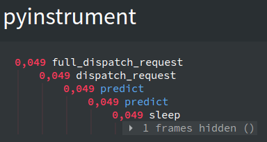
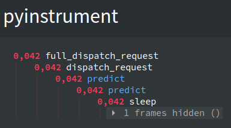

# Experiment

We will profile the Python code (server/client) during a simple REST API call in two different architectures (sync/async).

### Prerequisites

Before to run the tests, you need to run all the Docker images. Please, follow the instructions at the general [`README.md`](../../README.md) of the project.

### Deploy

```
pip install -r requirements.txt
```

### How to run

The script `profiler.py` is a command line interface prepared to run some profilers in our Python code in both ways (server and client).

We need to fill some arguments:

* mode: Choose the server to call (async/sync).
* profiler-client: Profiler to run in the server (yappi/pyinstrument). This is optional.
* profiler-server: Profiler to run in the server (yappi/pyinstrument). This is optional.
* profiler-server-html: Render results of pyinstrument profiler as html. This is optional.

### Example 1: Profiling Async vs Sync

Profiling sync client:

<pre>
$ python profiler.py --profiler-client pyinstrument --mode sync
</pre>

Output:
<pre>
  _     ._   __/__   _ _  _  _ _/_   Recorded: 21:30:54  Samples:  5
 /_//_/// /_\ / //_// / //_'/ //     Duration: 0.111     CPU time: 0.005
/   _/                      v3.3.0

Program: profiler.py --profiler-client pyinstrument --mode sync

0.110 main  profiler.py:24
└─ 0.110 post  requests/api.py:107
      [31 frames hidden]  requests, urllib3, http, socket, <bui...
         0.106 socket.recv_into  <built-in>:0
</pre>

Profiling async client:

<pre>
$ python profiler.py --profiler-client pyinstrument --mode async
</pre>

Output:
<pre>
  _     ._   __/__   _ _  _  _ _/_   Recorded: 21:30:51  Samples:  3
 /_//_/// /_\ / //_// / //_'/ //     Duration: 0.065     CPU time: 0.003
/   _/                      v3.3.0

Program: profiler.py --profiler-client pyinstrument --mode async

0.064 main  profiler.py:24
└─ 0.064 post  requests/api.py:107
      [28 frames hidden]  requests, urllib3, http, socket, <bui...
         0.062 socket.recv_into  <built-in>:0
</pre>

It seems that async version is faster than sync version. We should run it more times to check if this is true. We will focus on this in the [Experiment 2](../experiment2-benchmarking-timeit) and [Experiment 3](../experiment3-benchmarking-locust).


### Example2: Profiling Async Server

Now, we will profile the async server.

We will use `yappi` as profiler because it is more informative when we use async architecture.

Running:
<pre>
$ python profiler.py --profiler-client pyinstrument --profiler-server yappi --mode async
</pre>

Results:

First, on the client console we can see:

<pre>
  _     ._   __/__   _ _  _  _ _/_   Recorded: 20:18:03  Samples:  3
 /_//_/// /_\ / //_// / //_'/ //     Duration: 0.153     CPU time: 0.003
/   _/                      v3.3.0

Program: benchmark.py --profiler-client yappi --profiler-server yappi --mode async

0.152 main  benchmark.py:23
└─ 0.152 post  requests/api.py:107
      [28 frames hidden]  requests, urllib3, http, socket, <bui...
         0.150 socket.recv_into  <built-in>:0
</pre>

Seems like the total time to do the request is 152ms. Note that it take more time than in the first example because at this moment we are profiling in both servers (scoring and model), before we just profiled in the client.

Second, on the server console (Scoring API) we can see:

<pre>
Clock type: WALL
Ordered by: totaltime, desc

name                                  ncall  tsub      ttot      tavg
<b>..py:28 BaseHTTPMiddleware.call_next  1      0.091568  0.091697  0.091697</b>
..arlette/middleware/base.py:36 coro  1      0.000009  0.091491  0.091491
..py:56 ExceptionMiddleware.__call__  1      0.000008  0.091476  0.091476
../routing.py:545 APIRouter.__call__  1      0.000019  0.091468  0.091468
..tte/routing.py:219 APIRoute.handle  1      0.000007  0.091420  0.091420
..ckages/starlette/routing.py:38 app  1      0.000017  0.091413  0.091413
..ackages/fastapi/routing.py:175 app  1      0.000042  0.091360  0.091360
..uting.py:140 run_endpoint_function  1      0.000571  0.090535  0.090535
/app/app/main.py:47 predict           1      0.000076  0.089874  0.089874
/app/app/main.py:69 <listcomp>        1      0.000014  0.078840  0.078840
<b>...8/asyncio/queues.py:154 Queue.get  3      0.078707  0.078724  0.026241</b>
..asyncio/tasks.py:603 _wait_for_one  2      0.000004  0.078721  0.039360
..x/_client.py:1613 AsyncClient.post  2      0.000005  0.076294  0.038147
..client.py:1328 AsyncClient.request  2      0.000000  0.076289  0.038144
..x/_client.py:1376 AsyncClient.send  2      0.000000  0.075419  0.037709
..29 AsyncClient._send_handling_auth  2      0.000000  0.074401  0.037200
..yncClient._send_handling_redirects  2      0.000008  0.074368  0.037184
..1 AsyncClient._send_single_request  2      0.000000  0.074347  0.037173
<b>..x/_auth.py:79 Auth.async_auth_flow  2      0.073857  0.073862  0.036931</b>
..y:181 AsyncConnectionPool.arequest  2      0.000000  0.072420  0.036210
..py:75 AsyncHTTPConnection.arequest  2      0.000000  0.071845  0.035922
<b>..n3.8/asyncio/tasks.py:434 wait_for  10     0.070678  0.070886  0.007089</b>
..:50 AsyncHTTP11Connection.arequest  2      0.000000  0.070751  0.035375
..yncHTTP11Connection._receive_event  6      0.000000  0.070118  0.011686
..HTTP11Connection._receive_response  2      0.000011  0.069836  0.034918
..s/asyncio.py:139 SocketStream.read  2      0.000014  0.069252  0.034626
..o/streams.py:643 StreamReader.read  2      0.000021  0.069084  0.034542
<b>..py:493 StreamReader._wait_for_data  2      0.069058  0.069060  0.034530</b>
..lient.py:1190 AsyncClient.__init__  1      0.000065  0.007944  0.007944
..y:1269 AsyncClient._init_transport  1      0.000014  0.007296  0.007296
..x/_config.py:43 create_ssl_context  1      0.000006  0.007253  0.007253
..x/_config.py:61 SSLConfig.__init__  1      0.000004  0.007247  0.007247
..g.py:75 SSLConfig.load_ssl_context  1      0.000007  0.007243  0.007243
.. SSLConfig.load_ssl_context_verify  1      0.000032  0.007211  0.007211
..t.py:282 AsyncClient.build_request  2      0.000027  0.001954  0.000977
<b>..ges/redis/client.py:1602 Redis.get  1      0.000003  0.001932  0.001932</b>
<b>..lient.py:894 Redis.execute_command  1      0.000020  0.001929  0.001929</b>
..1180 ConnectionPool.get_connection  1      0.000015  0.001682  0.001682
...more calls...

127.0.0.1:40820 - "POST /api/v1/ml/async/predict?profile=%2Fhome%2Fdpadial%2Fprojects%2Fscoring-handler%2Fprofiling%2Fexperiment1%2Foutput%2Fclient%2Fserver&profile-type=yappi HTTP/1.1" 200
</pre>

I have used bold type to highlight the most interesting functions. As you can see, the most of the time is spent waiting for our asynchronous request call. Also, we have a small timeout getting information from Redis.

Third, on the server console (Model API) we have 2 calls like this one:

<pre>
Clock type: WALL
Ordered by: totaltime, desc

name                                  ncall  tsub      ttot      tavg
..arlette/middleware/base.py:36 coro  2      0.000016  0.091276  0.045638
..py:56 ExceptionMiddleware.__call__  2      0.000017  0.091248  0.045624
../routing.py:545 APIRouter.__call__  2      0.000041  0.091231  0.045615
..tte/routing.py:219 APIRoute.handle  2      0.000012  0.091133  0.045566
..ckages/starlette/routing.py:38 app  2      0.000031  0.091121  0.045560
..ackages/fastapi/routing.py:175 app  2      0.000071  0.091013  0.045506
..uting.py:140 run_endpoint_function  2      0.000003  0.089762  0.044881
/app/app/main.py:43 predict           2      0.000008  0.089759  0.044879
..app/model.py:10 AsyncModel.predict  2      0.000011  0.089751  0.044875
<b>..thon3.8/asyncio/tasks.py:630 sleep  2      0.089710  0.089726  0.044863</b>
..py:28 BaseHTTPMiddleware.call_next  1      0.000021  0.046460  0.046460
<b>...8/asyncio/queues.py:154 Queue.get  1      0.046343  0.046352  0.046352</b>
..i/routing.py:95 serialize_response  2      0.000009  0.000429  0.000214
..es/utils.py:465 solve_dependencies  2      0.000050  0.000421  0.000210
..pi/encoders.py:28 jsonable_encoder  6/2    0.000036  0.000420  0.000070
..hon3.8/abc.py:96 __instancecheck__  8      0.000007  0.000378  0.000047
...more calls...

127.0.0.1:49934 - "POST /api/v1/ml/async/predict?profile=%2Fhome%2Fdpadial%2Fprojects%2Fscoring-handler%2Fprofiling%2Fexperiment1%2Foutput%2Fclient%2Fserver&profile-type=yappi HTTP/1.1" 200
</pre>

As you can see, the most of the time is spent in a `asyncio.sleep()` function. Make sense.


### Example 3: Profiling Sync Server (yappi)


Running:

<pre>
$ python profiler.py --profiler-client pyinstrument --profiler-server yappi --mode sync
</pre>

Results:

First, on the client console we can see:

<pre>
  _     ._   __/__   _ _  _  _ _/_   Recorded: 21:57:08  Samples:  3
 /_//_/// /_\ / //_// / //_'/ //     Duration: 0.237     CPU time: 0.003
/   _/                      v3.3.0

Program: profiler.py --profiler-client pyinstrument --profiler-server yappi --mode sync

0.236 main  profiler.py:24
└─ 0.236 post  requests/api.py:107
      [22 frames hidden]  requests, urllib3, http, socket, <bui...
         0.234 socket.recv_into  <built-in>:0
</pre>

The total time to do the request is 236ms. Again, it seems slower than our async version (152ms in the second example, just updating the sync/async CLI option).

Second, on the server console (Scoring API) we can see:

<pre>
Clock type: WALL
Ordered by: totaltime, desc

name                                  ncall  tsub      ttot      tavg
<b>..app.py:1914 Flask.dispatch_request  1      0.000073  0.184375  0.184375
/app/app/main.py:42 predict           1      0.000064  0.184205  0.184205
/app/app/main.py:64 <listcomp>        1      0.000016  0.182430  0.182430
..-packages/requests/api.py:107 post  2      0.000041  0.182414  0.091207
..ackages/requests/api.py:16 request  2      0.000057  0.182373  0.091186
..ts/sessions.py:470 Session.request  2      0.000070  0.180482  0.090241
..uests/sessions.py:626 Session.send  2      0.000130  0.172122  0.086061
..s/adapters.py:394 HTTPAdapter.send  2      0.000105  0.170554  0.085277
...py:518 HTTPConnectionPool.urlopen  2      0.000167  0.166150  0.083075
..7 HTTPConnectionPool._make_request  2      0.000144  0.161801  0.080901
..py:1303 HTTPConnection.getresponse  2      0.000047  0.159316  0.079658
..p/client.py:300 HTTPResponse.begin  2      0.000125  0.159138  0.079569
..t.py:267 HTTPResponse._read_status  2      0.000071  0.156891  0.078446
...8/socket.py:655 SocketIO.readinto  2      0.000028  0.156774  0.078387</b>
..ons.py:430 Session.prepare_request  2      0.000087  0.004674  0.002337
..l/url.py:210 _encode_invalid_chars  14     0.002921  0.004349  0.000311
../urllib3/util/url.py:330 parse_url  6      0.000248  0.003798  0.000633
..Session.merge_environment_settings  2      0.000041  0.003573  0.001786
..s/utils.py:770 get_environ_proxies  2      0.000013  0.003373  0.001686
...py:292 HTTPAdapter.get_connection  2      0.000028  0.003104  0.001552
..est.py:2490 getproxies_environment  4      0.000408  0.003045  0.000761
..ions_abc.py:742 ItemsView.__iter__  196    0.000622  0.002843  0.000015
..86 PoolManager.connection_from_url  2      0.000021  0.002787  0.001393
..els.py:310 PreparedRequest.prepare  2      0.000047  0.002701  0.001350
..tion.py:226 HTTPConnection.request  2      0.000054  0.002127  0.001063
..8/http/client.py:204 parse_headers  2      0.000151  0.001980  0.000990
...more calls...

</pre>

As you can see, most of the time is spent not on functions, but on sub-calls (request POST). 

Following the `yappi` documentation:

| *Title* | *Description*                                                        |
|---------|----------------------------------------------------------------------|
| name    | the full unique name of the called function.                         |
| ncall   | How many times this function is called.                              |
| tsub    | How much time this function has spent in total, subcalls excluded.   |
| ttot    | How much time this function has spent in total, subcalls included.   |
| tavg    | How much time this function has spent in average, subcalls included. |

To get more info about this, you can check the `yappi` documentation: https://github.com/sumerc/yappi/blob/master/doc/introduction.md

Again, make sense because most of the time will be spent sleeping in Model API.

Third, on the server console (Model API) we have 2 calls like this one (we see the last of the two):

<pre>
Clock type: WALL
Ordered by: totaltime, desc

name                                  ncall  tsub      ttot      tavg
..app.py:1914 Flask.dispatch_request  2      0.000038  0.086300  0.043150
/app/app/main.py:41 predict           2      0.000051  0.086226  0.043113
../app/model.py:10 SyncModel.predict  2      0.000059  0.085820  0.042910
..app.py:1955 Flask.finalize_request  2/1    0.000485  0.024656  0.012328
..app.py:2246 Flask.process_response  2/1    0.000037  0.023194  0.011597
/app/app/main.py:62 after_request     2/1    0.000273  0.023127  0.011563
..ManagerProfileYappi.stop_and_write  2/1    0.000033  0.022660  0.011330
..sk/app.py:2029 Flask.make_response  3      0.000061  0.002403  0.000801
..flask/json/__init__.py:306 jsonify  2      0.000184  0.002318  0.001159
..ocal.py:344 LocalProxy.__getattr__  33     0.000175  0.001572  0.000048
..p.py:2219 Flask.preprocess_request  1      0.000024  0.001224  0.001224
/app/app/main.py:52 before_request    1      0.000079  0.001181  0.001181
..300 LocalProxy._get_current_object  42     0.000251  0.000930  0.000022
...more calls...

</pre>

As you can see, we are calling 2 times to `predict`, and every of the calls spent 43ms. So, we have 86ms in total.

Using, `yappi` we don't get a lot of info about the system calls (as `sleep`).

So, we will run other example using `pyinstrument` on sync architecture.


### Example 4: Profiling Sync Server (pyinstrument)

Doing this example, Docker could have problems to open a browser. Also, the docker optimized image for Flask have several problems to log the pyinstrument results (https://github.com/tiangolo/meinheld-gunicorn-flask-docker/issues/43, https://github.com/mopemope/meinheld/issues/118).

So, I recommend you to stop the Docker sync images and run the servers in local way:

Stopping Docker sync images
```
docker stop sync_flask_container
docker stop scoring_sync_flask_container
```

Running Flask Model API in local:
```
export FLASK_APP=api_model/sync/app/main.py
flask run
```

Run Flask Scoring API in local:
```
export FLASK_APP=api_scoring/sync/app/main.py
export FLASK_RUN_PORT=5001
flask run
```

**Note:** Using the local Flask deployment, we don't use the "auto-tuning" configuration to give the best performance, but it is ok to profile our `sleep` functions, we will use the improved Docker image to run benchmarking in the next experiments.

Running:

<pre>
$ python profiler.py --profiler-server pyinstrument --mode sync --profiler-server-html
</pre>

This option open automatically 3 browser windows. One for `api_scoring` and two for the two calls to `api_model`.

As you can see, every sync call take 49ms and 42ms respectively.

<pre>
  _     ._   __/__   _ _  _  _ _/_   Recorded: 11:55:59  Samples:  1
 /_//_/// /_\ / //_// / //_'/ //     Duration: 0.050     CPU time: 0.001
/   _/                      v3.3.0

Program: /home/dpadial/projects/scoring-handler/env3.8/bin/flask run

0.049 full_dispatch_request  flask/app.py:1938
└─ 0.049 dispatch_request  flask/app.py:1914
   └─ 0.049 predict  app/main.py:41
      └─ 0.049 predict  app/model.py:10
         └─ 0.049 sleep  ../../:0
               [2 frames hidden]  ..

127.0.0.1 - - [16/Feb/2021 11:55:59] "POST /api/v1/ml/sync/predict?profile=%2Fhome%2Fdpadial%2Fprojects%2Fscoring-handler%2Fprofiling%2Fexperiment1%2Foutput%2Fclient%2Fserver&profile-type=pyinstrument&render-browser=true HTTP/1.1" 200 -
</pre>

<pre>
  _     ._   __/__   _ _  _  _ _/_   Recorded: 11:55:59  Samples:  1
 /_//_/// /_\ / //_// / //_'/ //     Duration: 0.042     CPU time: 0.001
/   _/                      v3.3.0

Program: /home/dpadial/projects/scoring-handle/env3.8/bin/flask run

0.042 full_dispatch_request  flask/app.py:1938
└─ 0.042 dispatch_request  flask/app.py:1914
   └─ 0.042 predict  app/main.py:41
      └─ 0.042 predict  app/model.py:10
         └─ 0.042 sleep  ../../<built-in>:0
               [2 frames hidden]  ..

127.0.0.1 - - [16/Feb/2021 11:56:00] "POST /api/v1/ml/sync/predict?profile=%2Fhome%2Fdpadial%2Fprojects%2Fscoring-handler%2Fprofiling%2Fexperiment1%2Foutput%2Fclient%2Fserver&profile-type=pyinstrument&render-browser=true HTTP/1.1" 200 -
</pre>

HTML outputs:






# Conclusions

* Async version seems faster than sync.
* Our code is working as we expect. The bottleneck is the `time.sleep()` or `asyncio.sleep()` in the Model API processes.
