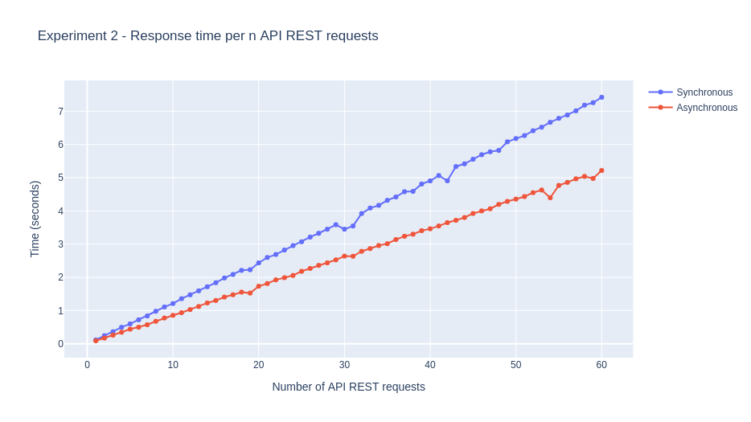

# Experiment

It is a simple experiment using `timeit`, a Python utility to do some simple performance tests.

### Prerequisites

Before to run the tests, you need to run all the Docker images. Please, follow the instructions at the general [`README.md`](../../README.md) of the project.

### Deploy

```
pip install -r requirements.txt
```

### How to run

The script `load.py` is a command line interface prepared to run some simple benchmarks for our REST API servers.

First, run a simple benchmark:
```
$ python load.py --min-number-calls 1 --max-number-calls 5 --repetitions 1
```

Output:
<pre>
Iteration number 1
Running 1 times 1 Async API calls at 0.08934803500051203 seconds
Running 1 times 1 Sync API calls at 0.1396597399998427 seconds
Iteration number 2
Running 1 times 2 Async API calls at 0.13527403099942603 seconds
Running 1 times 2 Sync API calls at 0.2619772620000731 seconds
Iteration number 3
Running 1 times 3 Async API calls at 0.21136354000009305 seconds
Running 1 times 3 Sync API calls at 0.40789839700119046 seconds
Iteration number 4
Running 1 times 4 Async API calls at 0.3654368940005952 seconds
Running 1 times 4 Sync API calls at 0.5530168900004355 seconds
<b>The servers are successfully benchmarked. The experiment results are in /home/dpadial/projects/scoring-handler/profiling/experiment2-benchmarking-timeit/output/results_1_5_1.csv</b>
</pre>

### Results

Now, we can explore some results of some long benchmarks:

Input:

```
$ python load.py --min-number-calls 1 --max-number-calls 30 --repetitions 20
```

Output:



Also, you can explore results using Jupyter Notebook.

```
jupyter-notebook explore.ipynb
```

Note: You should set the name of the input file in the notebook to explore results of your benchmark.

### Conclusions

* In average, the Async REST API is +29% faster than Sync REST API.
