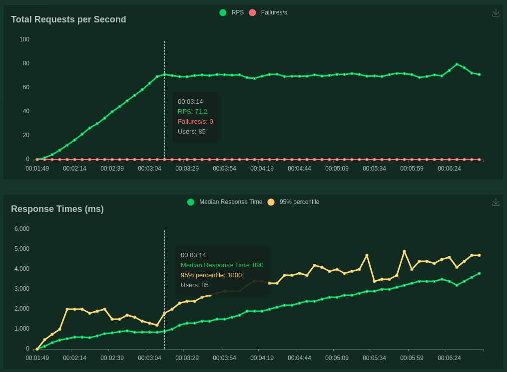
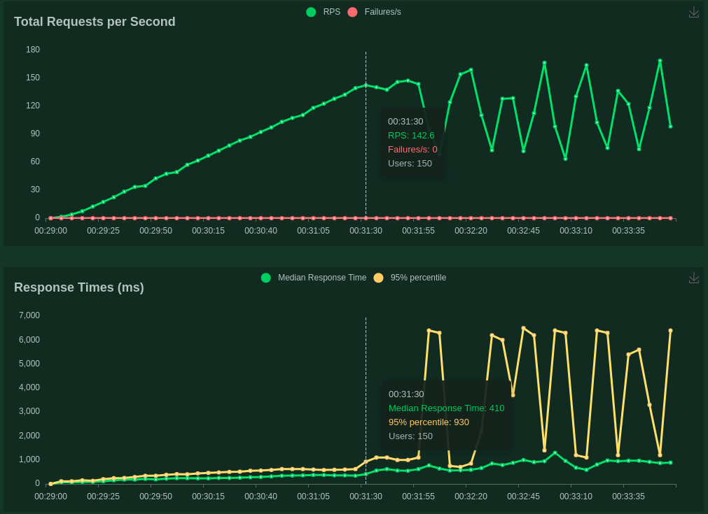
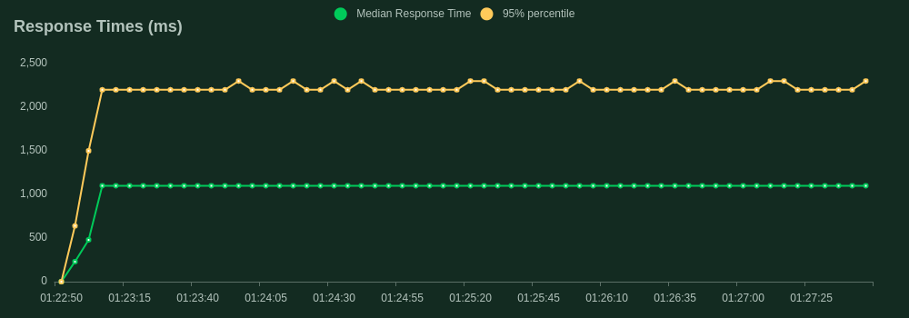
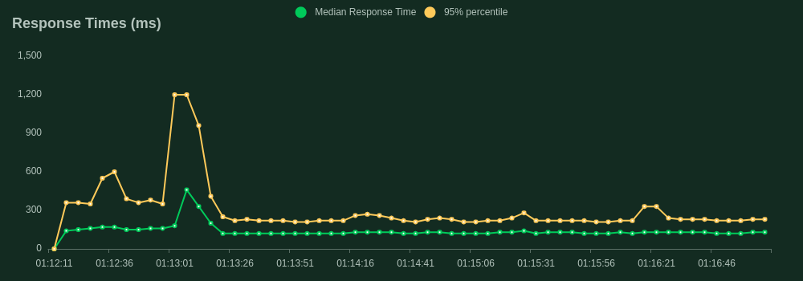

# Locust Experiment


### Introduction

There are a lot of tools to do benchmarking or load tests (JMeter, Gatling, Apache Benchmark, Siege, Locust, Molotov).

So, why Locust?

* Pythonic: You define the behavior of your users in regular Python code, instead of using a clunky UI or domain specific language.
* Pythonic: Version control your tests as regular code (as opposed to some other tools that use XML or binary formats).
* Output Friendly: Locust has a user friendly web interface that shows the progress of your test in real-time. Also you can get an HTML report and CSV details.

We have defined our test at `benchmark.py`. Please, take a look to the file and read the [Locust documentation quickstart](https://docs.locust.io/en/stable/quickstart.html).


### Prerequisites

Before to run the tests, you need to run all the Docker images. Please, follow the instructions at the general [`README.md`](../../README.md) of the project.


### Deploy

```
pip install -r requirements.txt
```


### Example 1: Response Time

We will test the performance application for normal requests (low traffic), getting the rate of requests per second.

We will run our test 100 times (one time per second, during 100 seconds), in order to get the average of response time, using one simple request for both (sync and async) servers.

#### Async

Running:
<pre>
$ locust -f benchmark.py --host http://localhost:8001 --headless --users 1 --spawn-rate 1 --run-time 100s --html output/response_time_async.html --csv=output/response_time_async ApiAsyncUser
</pre>

Output:
<pre>
 Name                                                          # reqs      # fails  |     Avg     Min     Max  Median  |   req/s failures/s
--------------------------------------------------------------------------------------------------------------------------------------------
 POST /api/v1/ml/async/predict                                    100     0(0.00%)  |      83      55     111      87  |    1.01    0.00
--------------------------------------------------------------------------------------------------------------------------------------------
 Aggregated                                                       100     0(0.00%)  |      83      55     111      87  |    1.01    0.00
</pre>

#### Sync

Running:
<pre>
$ locust -f benchmark.py --host http://localhost:5001 --headless --users 1 --spawn-rate 1 --run-time 100s --html output/response_time_sync.html --csv=output/response_time_sync ApiSyncUser
</pre>


Output:
<pre>
 Name                                                          # reqs      # fails  |     Avg     Min     Max  Median  |   req/s failures/s
--------------------------------------------------------------------------------------------------------------------------------------------
 POST /api/v1/ml/sync/predict                                     100     0(0.00%)  |     116     102     127     120  |    1.01    0.00
--------------------------------------------------------------------------------------------------------------------------------------------
 Aggregated                                                       100     0(0.00%)  |     116     102     127     120  |    1.01    0.00
</pre>

So, in average the response time for our Sync architecture (Flask) server is 116ms and 83 ms for our Async architecture (FlastAPI) server.


### Example 2: Constant Incremental Load Test

We will test how the application behaves in high traffic times and we will find the architectures breaking points.

The test will submit several request (from 1 to 300) every second during 300 seconds.

#### Sync

Running:

<pre>
locust -f benchmark.py --host http://localhost:5001 --headless --users 300 --spawn-rate 1 --run-time 300s --html output/load_test_sync.html --csv=output/load_test_sync ApiSyncUser
</pre>

Output:



Please, check [the complete output report](output/load_test_sync.html).

As you can see, seems as 85 is the max number of simultaneous request POST every second that our Synchronous architecture can manage properly.

At this point, the median response time is 890ms.

If you do more requests than 85, then you would increase the response time, but you will have the same requests per second.

#### Async

Running:

<pre>
$ locust -f benchmark.py --host http://localhost:8001 --headless --users 300 --spawn-rate 1 --run-time 300s --html output/load_test_async.html --csv=output/load_test_async ApiAsyncUser
</pre>

Output:



Please, check [the complete output report](output/load_test_async.html).

As you can see, seems as 150 is the max number of simultaneous request POST every second that our Asynchronous architecture can manage properly.

At this point, the median response time is 410ms.

If you do more requests than 150, then you would increase the response time, and the total request per second will be unstable.


### Example 3: Maximum performance

We will test the behavior of both architectures in the max point selected in the Example 2 during a long period of time.

#### Sync

Running:

<pre>
$ locust -f benchmark.py --host http://localhost:5001 --headless --users 85 --spawn-rate 85 --run-time 300s --html output/max_performance_sync.html --csv=output/max_performance_sync ApiSyncUser
</pre>

Output:



Please, check [the complete output report](output/max_performance_sync.html).

The results are stable and performs as expected.

#### Async

Running:

<pre>
$ locust -f benchmark.py --host http://localhost:8001 --headless --users 150 --spawn-rate 150 --run-time 300s --html output/max_performance_async.html --csv=output/max_performance_async ApiAsyncUser
</pre>

Output:



Please, check [the complete output report](output/max_performance_async.html).

The results are stable and performs as expected.


### Example 4: Stress test

We will test how the application operates in a "stress situation" during a long period of time.

This test will push the applications from the max performance to the limits.

#### Sync

Running:

<pre>
$ locust -f benchmark.py --host http://localhost:5001 --headless --users 500 --spawn-rate 5 --run-time 100s --html output/stress_test_sync.html --csv=output/stress_test_sync ApiSyncUser
</pre>

Output:


Please, check [the complete output report](output/stress_test_sync.html).

The higher the number of requests the longer the response time, however, the ratio of requests per second seems to be stable.

#### Async

Running:

<pre>
$ locust -f benchmark.py --host http://localhost:8001 --headless --users 500 --spawn-rate 5 --run-time 100s --html output/stress_test_async.html --csv=output/stress_test_async ApiAsyncUser
</pre>

Output:


Please, check [the complete output report](output/stress_test_async.html).

The higher the number of requests the longer the response time, however, the ratio of requests per second seems to be stable.

**Note:** 

You can use the Web-based UI of Locust if you want to see how are generated all of these data in real time. Just, remove the options `--headless` and `--run-time` from the commands.

Then, point your browser --> `http://0.0.0.0:8089` and "Start Swarming".

**Note 2:** 

All the experiments produce some CSV file results. In the future, I would like to explore them in a Jupyter Notebook EDA.
